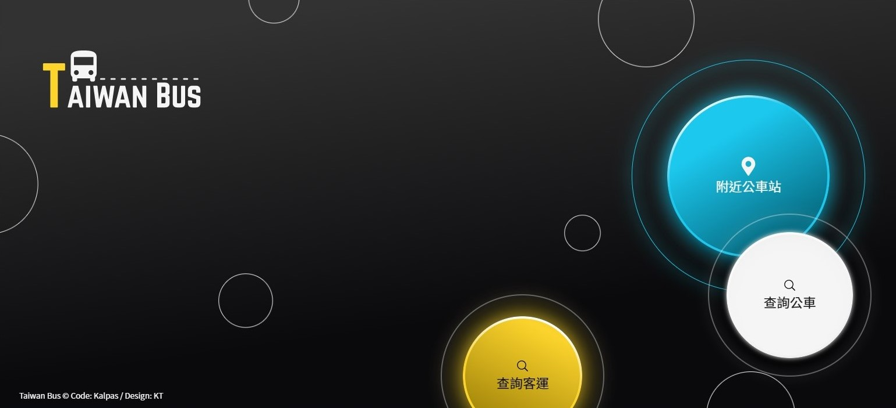

# Taiwan Bus

這份 project 是我參加 2021 年第三屆的 F2E 第三關的作品，主題為：全台灣公車動態時刻查詢應用服務，使用的 API 為交通部 TDX 平台提供，使用的設計稿是設計師 KT 製作，設計稿可以看[這裡](https://2021.thef2e.com/users/6296432819610583177/)

[線上 Demo](https://taiwan-bus.vercel.app)

## Features

- 台灣市區公車與公路客運資訊線上查詢
- 公車路線動態資訊，提供公車預估到站時間
- 公車站位資訊，提供此站所有路線
- 顯示所在位置附近公車站
- 提供客運路線票價
- 提供客運路線發車時刻
- 路線、公車站與所在位置公車站皆提供地圖觀看
- 標示出無障礙公車
- 響應式設計

## 使用技術

- Vue 3
- Vue 3 Composition API
- Vite
- Bootstrap 5
- Sass
- Leaflet Map
